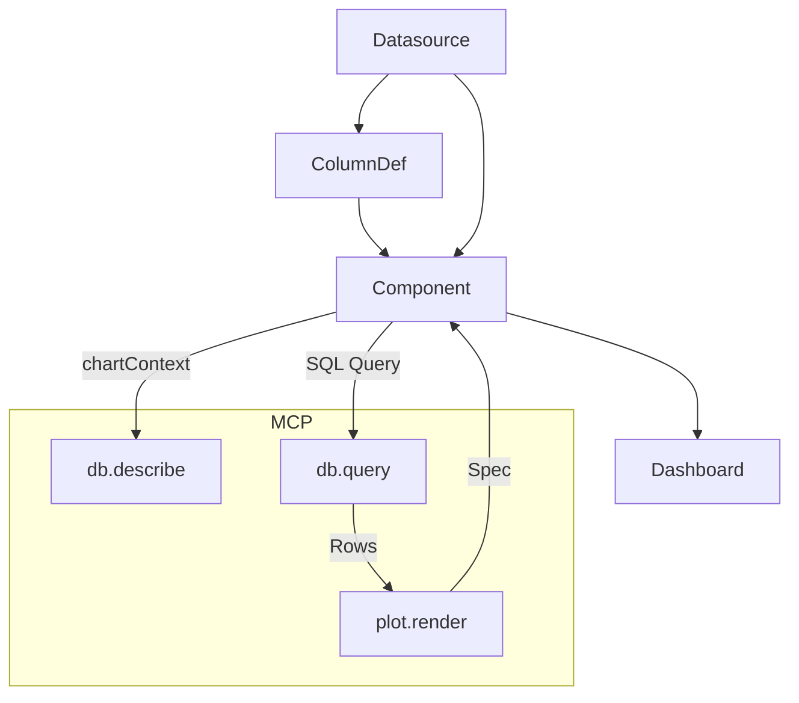

# 📑 MCP-RAG 后端扩展开发计划

## 🎯 总体目标
基于已有的 **MCP-RAG 后端**，扩展出一个完整的 **智能化投研分析系统后端**，包含：  
- **数据建模**：看板（Dashboard）、组件（Component）、数据源（Datasource）  
- **AI 助手**：MCP 工具调用（数据库查询 + 绘图）  
- **流式交互**：支持前端实时接收 AI 输出  
- **前端配合规划**：看板管理（仿 Superset）+ AI 助手（仿 OpenBB）  

---

## 🛠️ 模块与功能拆解

### 1. 数据库与 ORM
- **模块**：models（SQLAlchemy）
- **功能**：  
  - Dashboard：包含多个组件  
  - Datasource：表/SQL 数据定义  
  - ColumnDef：列角色（维度/度量/OHLC）  
  - Component：绑定数据源，定义图表类型与配置（encoding + mark）
- **依赖**：Alembic 管理迁移

**API 设计**  
- `POST /dashboards` 创建看板  
- `GET /dashboards/{id}` 获取看板详情（含组件）  
- `POST /datasources` 创建数据源  
- `POST /components` 创建组件  

---

### 2. MCP 工具：数据库查询
- **已有**：`db.describe`、`db.query`  
- **优化**：增加对 **chartContext** 的支持（列白名单、角色过滤）

---

### 3. MCP 工具：绘图
- **新增工具**：`plot.render`
- **功能**：将 tabular 数据（rows）+ encoding/mark → 输出图表  
  - 方案1：返回 Vega-Lite Spec JSON（前端渲染）  
  - 方案2：后端生成 PNG base64（如 matplotlib）  
- **输入示例**：
  ```json
  {
    "rows": [{"date": "2024-01-01", "close": 120}],
    "encoding": {"x": "date", "y": "close"},
    "mark": "line"
  }
  ```
- **输出示例**：
  ```json
  { "ok": true, "spec": { "mark": "line", "encoding": {...} } }
  ```

---

### 4. AI 交互流式输出
- **接口**：`POST /agent/stream`
- **技术**：Server-Sent Events (SSE)  
- **功能**：逐步输出 AI 回复（文本 + 工具调用轨迹）  
- **作用**：前端能像 ChatGPT 一样边收边显示  

---

### 5. 前端规划
- **模块划分**  
  - 看板管理（Dashboard）：仿 Superset，grid 布局  
  - 数据源管理（Datasource）：仿 Superset Dataset  
  - 组件配置（Component）：选择数据源、配置 encoding/mark  
  - AI 助手（Agent）：仿 OpenBB，独立交互区，支持图表结果  
- **交互流程**  
  - 用户选组件 → 绑定数据源 → 渲染图表  
  - 用户提问 → `/agent/stream` → AI 生成 SQL + 图表 spec → 前端渲染  

---

## 🚀 分阶段实现计划

### Phase 1: 基础数据建模
- 建立数据库表：Dashboard / Component / Datasource / ColumnDef  
- 实现基础 CRUD API  
- Alembic 迁移脚本  

### Phase 2: MCP 数据查询
- 接入 db.query，支持 chartContext 校验  
- 前端能基于组件的数据源取数  

### Phase 3: MCP 绘图工具
- 新增 `plot.render`  
- AI 可以先 query → 再 render → 返回图表 spec  
- 前端组件支持渲染 Vega-Lite spec  

### Phase 4: AI 流式交互
- `/agent/stream` SSE 接口  
- 前端逐步展示回答  

### Phase 5: 前端集成
- 看板页面：组件渲染（grid 布局）  
- 数据源页面：管理表/SQL + 列角色  
- 组件配置面板：encoding/mark 选择  
- AI 助手：对话区 + 图表结果  

### Phase 6: 扩展优化
- 支持 K 线图（OHLC role）  
- 支持多组件上下文（JOIN）  
- 审计日志：保存所有 AI 调用轨迹  

---

## 🔗 模块依赖关系



# issue list

1. 检查组件宽度逻辑：现在看板刷新\页面切换后再切回来，如果右侧聊天区没收回，则会有宽度缩小的问题；
2. 组件添加上下文的按钮，+号点击加入上下文，再次点击时可以移除上下文；
3. AI chat不需要下拉框勾选provider信息；
4. 调整AI chat 的输入框、发送、终止、重试按钮，把按钮排成一排，放在输入框里面；
5. NVDA现在的logo是怎么配置的？能不能换成stock-watch list里的绿点logo? 
6. 在k线图里的灰色小标题，内容改为symbol.1D.NASDAQ，自动检索数据源的symbol情况，如果是NVDA或者APPL则渲染这个小标题，没有就不渲染了；
7. 把数据源和数据库连接相关页面和弹窗，看板添加、组件添加相关页面、弹窗，静态文字里的英文翻译成中文；
8. 添加和修改组件的对话框，调整大小，增加大小，我觉得扩展到覆盖除了左边栏的右边整个区域都是合理的，关键是要避免字段拥挤以及能充分预览图表生成情况。
9. k线图里的填充字段提示可以有，但是应该放在对话框左上区域，而不是预览图里，为其他类型组件也添加这个提示。预览里面再写一个xxx preview标题。
10. text类型组件，添加后是一个是支持edit的类似markdown实时渲染编辑或者word那种区域？实时可编辑和渲染内容。
11. bar \ line类型图表，date数据过于密集时，x轴很挤很难看，可以考虑只展示图幅头尾区间点的值
12. 可以考虑支持同一个组件里显示多个同x轴的bar,line。那就是创建或者修改的对话框里有这部分逻辑，可以额外创建第x个，引用其他data

----------------
13. 左侧栏里只能看板下面的区域是可折叠的。看板也支持删除。
14. 看板内容容器，初始化为空图幅，当读取不到组件信息时，再展示原添加组件or添加文件的大卡片
15. 把搜索功能也挪到智能看板里，（可以和+号一行点击唤出），支持按看板名搜索模糊匹配，原搜索位置留一个logo+title占位
16. 数据源支持修改操作
17. 鸽鸽
18. 添加组件的dialog,在切换类型时，重置表单
19. 所有dialog在提交后记得重置表单，包括数据源、数据库连接

---

## 🧰 运维脚本（Ops）
- 可选：组件配置多序列迁移（将旧版单 y 配置持久化为 encoding.series）  
  - 脚本：`backend/scripts/migrate_component_configs_to_multiseries.py`  
  - 功能：
    - 将 legacy `encoding.y` → `encoding.series = [{ y, label }]`
    - 将 legacy `encoding.color` → `encoding._legacyColor`
    - 对于 bar，确保 `options.stacked` 字段存在（默认 false）
  - 特性：幂等；支持 `--dry-run` 预演；不更改 query_config
  - 说明：后端已做「读时迁移」，本脚本仅用于一次性持久化到 DB
- 数据源表结构对齐（旧库 → 新库字段补齐）  
  - 脚本：`backend/scripts/migrate_legacy_schema.py`  
  - 功能：为 `datasources` 表补齐缺失列与外键，安全重复执行