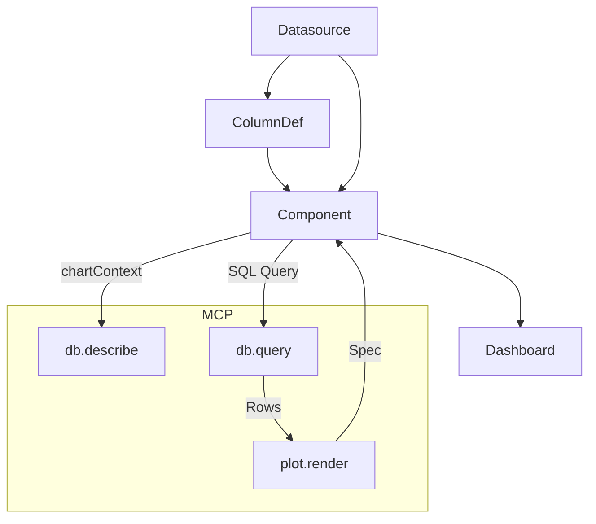

# 📑 MCP-RAG 后端扩展开发计划

## 🎯 总体目标
基于已有的 **MCP-RAG 后端**，扩展出一个完整的 **智能化投研分析系统后端**，包含：  
- **数据建模**：看板（Dashboard）、组件（Component）、数据源（Datasource）  
- **AI 助手**：MCP 工具调用（数据库查询 + 绘图）  
- **流式交互**：支持前端实时接收 AI 输出  
- **前端配合规划**：看板管理（仿 Superset）+ AI 助手（仿 OpenBB）  

---

## 🛠️ 模块与功能拆解

### 1. 数据库与 ORM
- **模块**：models（SQLAlchemy）
- **功能**：  
  - Dashboard：包含多个组件  
  - Datasource：表/SQL 数据定义  
  - ColumnDef：列角色（维度/度量/OHLC）  
  - Component：绑定数据源，定义图表类型与配置（encoding + mark）
- **依赖**：Alembic 管理迁移

**API 设计**  
- `POST /dashboards` 创建看板  
- `GET /dashboards/{id}` 获取看板详情（含组件）  
- `POST /datasources` 创建数据源  
- `POST /components` 创建组件  

---

### 2. MCP 工具：数据库查询
- **已有**：`db.describe`、`db.query`  
- **优化**：增加对 **chartContext** 的支持（列白名单、角色过滤）

---

### 3. MCP 工具：绘图
- **新增工具**：`plot.render`
- **功能**：将 tabular 数据（rows）+ encoding/mark → 输出图表  
  - 方案1：返回 Vega-Lite Spec JSON（前端渲染）  
  - 方案2：后端生成 PNG base64（如 matplotlib）  
- **输入示例**：
  ```json
  {
    "rows": [{"date": "2024-01-01", "close": 120}],
    "encoding": {"x": "date", "y": "close"},
    "mark": "line"
  }
  ```
- **输出示例**：
  ```json
  { "ok": true, "spec": { "mark": "line", "encoding": {...} } }
  ```

---

### 4. AI 交互流式输出
- **接口**：`POST /agent/stream`
- **技术**：Server-Sent Events (SSE)  
- **功能**：逐步输出 AI 回复（文本 + 工具调用轨迹）  
- **作用**：前端能像 ChatGPT 一样边收边显示  

---

### 5. 前端规划
- **模块划分**  
  - 看板管理（Dashboard）：仿 Superset，grid 布局  
  - 数据源管理（Datasource）：仿 Superset Dataset  
  - 组件配置（Component）：选择数据源、配置 encoding/mark  
  - AI 助手（Agent）：仿 OpenBB，独立交互区，支持图表结果  
- **交互流程**  
  - 用户选组件 → 绑定数据源 → 渲染图表  
  - 用户提问 → `/agent/stream` → AI 生成 SQL + 图表 spec → 前端渲染  

---

## 🚀 分阶段实现计划

### Phase 1: 基础数据建模
- 建立数据库表：Dashboard / Component / Datasource / ColumnDef  
- 实现基础 CRUD API  
- Alembic 迁移脚本  

### Phase 2: MCP 数据查询
- 接入 db.query，支持 chartContext 校验  
- 前端能基于组件的数据源取数  

### Phase 3: MCP 绘图工具
- 新增 `plot.render`  
- AI 可以先 query → 再 render → 返回图表 spec  
- 前端组件支持渲染 Vega-Lite spec  

### Phase 4: AI 流式交互
- `/agent/stream` SSE 接口  
- 前端逐步展示回答  

### Phase 5: 前端集成
- 看板页面：组件渲染（grid 布局）  
- 数据源页面：管理表/SQL + 列角色  
- 组件配置面板：encoding/mark 选择  
- AI 助手：对话区 + 图表结果  

### Phase 6: 扩展优化
- 支持 K 线图（OHLC role）  
- 支持多组件上下文（JOIN）  
- 审计日志：保存所有 AI 调用轨迹  

---

## 🔗 模块依赖关系



---

## 🧰 运维脚本（Ops）
- 可选：组件配置多序列迁移（将旧版单 y 配置持久化为 encoding.series）  
  - 脚本：`backend/scripts/migrate_component_configs_to_multiseries.py`  
  - 功能：
    - 将 legacy `encoding.y` → `encoding.series = [{ y, label }]`
    - 将 legacy `encoding.color` → `encoding._legacyColor`
    - 对于 bar，确保 `options.stacked` 字段存在（默认 false）
  - 特性：幂等；支持 `--dry-run` 预演；不更改 query_config
  - 说明：后端已做「读时迁移」，本脚本仅用于一次性持久化到 DB
- 数据源表结构对齐（旧库 → 新库字段补齐）  
  - 脚本：`backend/scripts/migrate_legacy_schema.py`  
  - 功能：为 `datasources` 表补齐缺失列与外键，安全重复执行